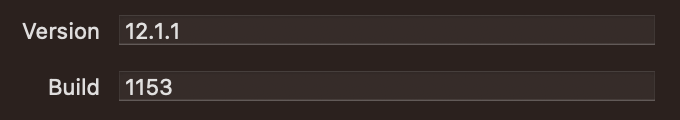

# SemVer

Реализация семантического версионирования. Подробно о нем вы можете прочитать на сайте [semver.org](https://semver.org/lang/ru/)

```
    3.25.12-alpha+sha.5114f85
    - -- -- ----- -----------
    |  |  |   |        |    
Major  |  |   |        Build
   Minor  |   |
      Patch   PreRelease

⚠️ Обратите внимание, что PreRelease и Build
представляются в виде набора идентификаторов,
разделяемых точкой (например, sha.5114f85 
или 23.243.6754.2)
```

## Установка

Добавить библиотеку можно через SPM:

```swift
.package(
    url: "https://github.com/RinatAbidullin/SemVer.git", 
    .upToNextMajor(from: "3.0.0")
)
```

## Создание версии

Создать версию можно двумя способами:

1. Передачей всех компонентов отдельно:

   ```swift
   // 1. Создаем версию "1.4.32"
   let version = try SemVer(
       major: 1,
       minor: 4,
       patch: 32
   )
   
   // 2. Создаем версию "1.4.32-alpha"
   let version = try SemVer(
       major: 1,
       minor: 4,
       patch: 32,
       preReleaseIdentifiers: ["alpha"]
   )
   
   // 3. Создаем версию "1.4.32+exp.sha.fd54sd"
   let version = try SemVer(
       major: 1,
       minor: 4,
       patch: 32,
       buildIdentifiers: ["exp", "sha", "fd54sd"]
   )
   
   // 4. Создаем версию "1.4.32-beta+exp.sha.fd54sd"
   let version = try SemVer(
       major: 1,
       minor: 4,
       patch: 32,
       preReleaseIdentifiers: ["beta"],
       buildIdentifiers: ["exp", "sha", "fd54sd"]
   )
   ```

2. Из строки.

   2.1 Строковое представление версии должно строго соответствовать требованиям `SemVer`, т.е. недопустимо опускать компоненты `Minor` или `Patch`, когда они равны `0`:

   ```swift
   // Создаем версию "1.4.0"
   let version = try SemVer(string: "1.4.0")
   
   // Создаем версию "1.4.2-alpha+1032"
   let version = try SemVer(string: "1.4.2-alpha+1032")
   ```
   
   2.2 Строковое представление версии может не соответствовать требованиям `SemVer`, т.е. возможны случаи, когда опускаются компоненты `Minor` или `Patch`, если они равны `0`. В этом случае можно использовать опцию `.allowSkippingMinorOrPatch`:
   
   ```swift
   // Создаем версию "1.4.0"
   let version = try SemVer(string: "1.4", options: [.allowSkippingMinorOrPatch])
   
   // Создаем версию "2.0.0"
   let version = try SemVer(string: "2", options: [.allowSkippingMinorOrPatch])
   
   // Создаем версию "1.0.0-alpha+1032"
   let version = try SemVer(string: "1.0-alpha")
   
   // ⚠️ Не используйте опцию `.allowSkippingMinorOrPatch`, если собираетесь
   // строго соответствовать правилам semver.org
   ```

## Сравнение версий

Версии поддерживают сравнения согласно правилам, опубликованным на [semver.org](https://semver.org/lang/ru/):

```swift
// "1.2.0" должна быть младше, чем "1.2.1"
let version1 = try SemVer(string: "1.2.0")
let version2 = try SemVer(string: "1.2.1")
version1 < version2 // true

// "1.2.0" должна быть старше, чем "1.2.0-alpha"
let version1 = try SemVer(string: "1.2.0")
let version2 = try SemVer(string: "1.2.0-alpha")
version1 > version2 // true

// "1.2.0-alpha" должна быть младше, чем "1.2.0-beta"
let version1 = try SemVer(string: "1.2.0-alpha")
let version2 = try SemVer(string: "1.2.0-beta")
version1 < version2 // true

// "1.2.0" должна быть эквивалентна "1.2.0+exp.sha.fd54sd", 
// так как Build не учитыватся при сравнении
let version1 = try SemVer(string: "1.2.0")
let version2 = try SemVer(string: "1.2.0+exp.sha.fd54sd")
version1 == version2 // true

// "1.2.0-beta.2" должна быть младше, чем "1.2.0-beta.11" (2 < 11)
let version1 = try SemVer(string: "1.2.0-beta.2")
let version2 = try SemVer(string: "1.2.0-beta.11")
version1 < version2 // true
```

## Преобразование версии в строку

Преобразуйте структуру `SemVer` в строку, например, когда нужно сохранить ее в БД:

```swift
// Создаем версию
let version = try SemVer(
    major: 1,
    minor: 4,
    patch: 32,
    preReleaseIdentifiers: ["beta"],
    buildIdentifiers: ["exp", "sha", "fd54sd"]
)

// Преобразовываем версию в строку, строго следуя правилам semver.org
let representation = version.asString // "1.4.32-beta+exp.sha.fd54sd"
```

⚠️ При необходимости можно управлять итоговым видом строкового представления версии, передавая дополнительные опции `[OutputOption]` (но имейте в виду, что это будет являться послаблениями в строгие правила [semver.org](https://semver.org/lang/ru/)):

```swift
// Создаем версию "1.0.0"
let version = try SemVer(
    major: 1,
    minor: 0,
    patch: 0
)

// Преобразовываем версию в строку, опуская `Patch`, когда он может быть равен 0
let representation = version.asString(with: [.omitPatchIfPossible]) // "1.0"

// Преобразовываем версию в строку, опуская `Minor` и `Patch`, когда они могут быть равны 0
let representation = version.asString(with: [.omitMinorAndPatchIfPossible]) // "1"
```

## Версия приложения (Xcode-проект)

Доступно расширение для `Bundle`, позволяющее получить версию приложения как `SemVer`:



```swift
let appVersion = Bundle.semVer // "12.1.1+1153"
```