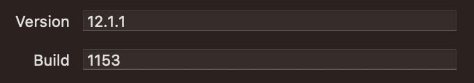

# SemVer

Implementation of semantic versioning. You can read more about it on the [semver.org](https://semver.org) website.

```
    3.25.12-alpha+sha.5114f85
    - -- -- ----- -----------
    |  |  |   |        |    
Major  |  |   |        Build
   Minor  |   |
      Patch   PreRelease

⚠️ Note that PreRelease and Build
are represented as a set of identifiers
separated by a dot (e.g., sha.5114f85 
or 23.243.6754.2).
```

## Translations

Translation is available in the following languages:
- [RU](README_RU.md)

## Installation

You can add the library via SPM:

```swift
.package(
    url: "https://github.com/RinatAbidullin/SemVer.git", 
    .upToNextMajor(from: "3.0.0")
)
```

## Creating a Version

You can create a version in two ways:

1. By passing all components separately:

   ```swift
   // 1. Create version "1.4.32"
   let version = try SemVer(
       major: 1,
       minor: 4,
       patch: 32
   )
   
   // 2. Create version "1.4.32-alpha"
   let version = try SemVer(
       major: 1,
       minor: 4,
       patch: 32,
       preReleaseIdentifiers: ["alpha"]
   )
   
   // 3. Create version "1.4.32+exp.sha.fd54sd"
   let version = try SemVer(
       major: 1,
       minor: 4,
       patch: 32,
       buildIdentifiers: ["exp", "sha", "fd54sd"]
   )
   
   // 4. Create version "1.4.32-beta+exp.sha.fd54sd"
   let version = try SemVer(
       major: 1,
       minor: 4,
       patch: 32,
       preReleaseIdentifiers: ["beta"],
       buildIdentifiers: ["exp", "sha", "fd54sd"]
   )
   ```

2. From a string.

   2.1 The string representation of the version must strictly adhere to `SemVer` specifications, meaning you cannot omit `Minor` or `Patch` components when they are `0`:

   ```swift
   // Create version "1.4.0"
   let version = try SemVer(string: "1.4.0")
   
   // Create version "1.4.2-alpha+1032"
   let version = try SemVer(string: "1.4.2-alpha+1032")
   ```
   
   2.2 The string representation of the version may not adhere strictly to `SemVer` specifications, meaning you can omit `Minor` or `Patch` components if they are `0`. In this case, use the option `.allowSkippingMinorOrPatch`:

   ```swift
   // Create version "1.4.0"
   let version = try SemVer(string: "1.4", options: [.allowSkippingMinorOrPatch])
   
   // Create version "2.0.0"
   let version = try SemVer(string: "2", options: [.allowSkippingMinorOrPatch])
   
   // Create version "1.0.0-alpha"
   let version = try SemVer(string: "1.0-alpha")
   ```

## Version Comparison

Versions support comparisons according to rules published on [semver.org](https://semver.org):

```swift
// "1.2.0" should be less than "1.2.1"
let version1 = try SemVer(string: "1.2.0")
let version2 = try SemVer(string: "1.2.1")
version1 < version2 // true

// "1.2.0" should be greater than "1.2.0-alpha"
let version1 = try SemVer(string: "1.2.0")
let version2 = try SemVer(string: "1.2.0-alpha")
version1 > version2 // true

// "1.2.0-alpha" should be less than "1.2.0-beta"
let version1 = try SemVer(string: "1.2.0-alpha")
let version2 = try SemVer(string: "1.2.0-beta")
version1 < version2 // true

// "1.2.0" should be equivalent to "1.2.0+exp.sha.fd54sd", 
// as Build is ignored in comparison
let version1 = try SemVer(string: "1.2.0")
let version2 = try SemVer(string: "1.2.0+exp.sha.fd54sd")
version1 == version2 // true

// "1.2.0-beta.2" should be less than "1.2.0-beta.11" (2 < 11)
let version1 = try SemVer(string: "1.2.0-beta.2")
let version2 = try SemVer(string: "1.2.0-beta.11")
version1 < version2 // true
```

## Version to String Conversion

Convert the `SemVer` structure to a string, for instance, when you need to store it in a database:

```swift
// Create version
let version = try SemVer(
    major: 1,
    minor: 4,
    patch: 32,
    preReleaseIdentifiers: ["beta"],
    buildIdentifiers: ["exp", "sha", "fd54sd"]
)

// Convert version to a string, strictly following semver.org rules
let representation = version.asString // "1.4.32-beta+exp.sha.fd54sd"
```

⚠️ If necessary, you can control the final string representation of the version by passing additional options `[OutputOption]` (but keep in mind that this will be a relaxation of the strict rules of [semver.org](https://semver.org)):

```swift
// Create version "1.0.0"
let version = try SemVer(
    major: 1,
    minor: 0,
    patch: 0
)

// Convert version to a string, omitting `Patch` when it can be `0`
let representation = version.asString(with: [.omitPatchIfPossible]) // "1.0"

// Convert version to a string, omitting `Minor` and `Patch` when they can be `0`
let representation = version.asString(with: [.omitMinorAndPatchIfPossible]) // "1"
```

## Application Version (Xcode Project)

An extension for `Bundle` is available, allowing you to obtain the application version as `SemVer`:



```swift
let appVersion = Bundle.semVer // "12.1.1+1153"
```

## Version Incrementing

To increment (increase) the version, use the `next(...)` function:

```swift
let version = try SemVer(string: "1.4.32")
let newMajorVersion = try version.next(.major) // "2.0.0"
let newMinorVersion = try version.next(.minor) // "1.5.0"
let newPatchVersion = try version.next(.patch) // "1.4.33"
```

By default, the `PreRelease` and `Build` components of the incremented version are removed:

```swift
let version = try SemVer(string: "1.4.32-beta+exp.sha.fd54sd")
let newMinorVersion = try version.next(.minor) // "1.5.0"
```

To change this behavior, use the second parameter. For example, `(preRelease: .keep, build: .delete)` will keep the `PreRelease` and delete the `Build` for the incremented version:

```swift
let version = try SemVer(string: "1.4.32-beta+exp.sha.fd54sd")
let newMinorVersion = try version.next(
    .minor, 
    with: (preRelease: .keep, build: .delete)
) 
// "1.5.0-beta"
```